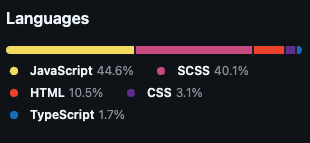
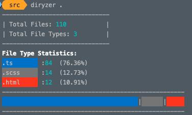

<div align="center">

# 🔍 Diryzer

A sleek command-line tool for analyzing directory contents with visual file type distribution.

[](https://www.npmjs.com/package/diryzer)
[](https://opensource.org/licenses/MIT)
[](https://github.com/SidiqovAbbos/diryzer/issues)
[](https://github.com/SidiqovAbbos/diryzer/stargazers)

</div>

## ✨ Features

- 📊 Visual progress bar showing file type distribution
- 🎨 Color-coded output for different file types
- 🔄 Customizable directory depth scanning
- 🚫 Pattern-based directory exclusion
- 📈 Optional percentage display

## 🌟 Inspired By

GitHub's repository languages section - A visual representation of language distribution in repositories:



## 💻 Global Usage

```bash
npm install -g diryzer
```

### Basic Command

```bash
diryzer <directory>
```

### Options

```bash
Options:
  -V, --version              output the version number
  -e, --exclude <patterns>   patterns to exclude from analysis
  -d, --depth <number>       depth of subdirectories to analyze (default: "5")
  -h, --help                 display help for command
```

### 📝 Examples

Analyze current directory:
```bash
diryzer .
```

Exclude specific directories:
```bash
diryzer --exclude 'node_modules/**' '.git' .
```

Set scan depth:
```bash
diryzer --depth 3 .
```

### 🖥️ Example Output



## 🔧 Programmatic Usage

To install `diryzer` as a development dependency in your project, run:

```bash
npm install diryzer --save-dev
```

You can then use it in your project scripts or directly in your code.
```typescript
import { DirectoryAnalyzer } from 'diryzer';

const diryzer = new DirectoryAnalyzer({
  directoryPath: './my-project',
  depth: 5,
  excludePatterns: ['node_modules/**']
});

const result = diryzer.analyze();
/* result is Record<string, FileType>
  {
    ".js": {
      extension: ".js";
      count: 2; 
      percentage: 25; 
    }
    ... others
  }
*/
```

## 🤝 Contributing

1. Fork the repository
2. Create your feature branch (`git checkout -b feature/amazing-feature`)
3. Commit your changes (`git commit -m 'Add amazing feature'`)
4. Push to the branch (`git push origin feature/amazing-feature`)
5. Open a Pull Request

## 📄 License

This project is licensed under the MIT License - see the [LICENSE](LICENSE) file for details.

## 🙏 Acknowledgments

- Built with TypeScript and Node.js
- Uses Commander.js for CLI interface
- Chalk for colorful terminal output

## 🌐 Links

- [GitHub Repository](https://github.com/SidiqovAbbos/diryzer)
- [Bug Reports](https://github.com/SidiqovAbbos/diryzer/issues)
- [npm Package](https://www.npmjs.com/package/diryzer)

---

<div align="center">
Made with ❤️ by developers for developers
</div>
